# Database

Catalogo de productos

```mermaid
erDiagram
    categories {
        uuid id PK
        varchar name
        text description
        uuid parent_id FK
        boolean is_active
        timestamp created_at
        timestamp updated_at
    }

    products {
        uuid id PK
        varchar name
        uuid category_id FK
        enum unit_of_measure "und, kg, mt, lt, m2, m3"
        numeric cost_price
        numeric sale_price
        numeric stock_quantity
        numeric min_stock
        numeric tax_rate
        boolean is_active
        timestamp created_at
        timestamp updated_at
        varchar barcode
        uuid tax_id FK
        uuid supplier_id FK
        uuid branch_id
        text description
        text image_url
        varchar product_type
        numeric reorder_point
        enum commercialization_type "UNIT, AREA, WEIGHT, LENGTH, VOLUME, BOX"
    }

    product_images {
        uuid id PK
        uuid product_id FK
        text storage_key
        smallint sort_order
        timestamptz created_at
    }

    product_packagings {
        uuid id PK
        uuid product_id FK
        uuid presentation_type_id FK
        varchar name
        varchar code
        numeric conversion_quantity
        varchar base_unit_code
        varchar barcode
        varchar sku
        numeric weight
        numeric length
        numeric width
        numeric height
        numeric suggested_sale_price
        boolean is_default_purchase
        boolean is_default_sale
        boolean is_active
        integer display_order
        timestamptz created_at
        timestamptz updated_at
    }

    packaging_presentation_types {
        uuid id PK
        varchar code
        varchar name
        varchar group_code
        integer display_order
        boolean is_active
        timestamptz created_at
        timestamptz updated_at
    }

    product_box_specs {
        uuid id PK
        uuid product_id FK
        integer units_per_box
        numeric box_weight_kg
        boolean sell_only_full_box
        boolean allow_loose_units
        timestamptz created_at
        timestamptz updated_at
    }

    product_length_specs {
        uuid id PK
        uuid product_id FK
        varchar base_unit
        boolean allow_decimal_sales
        numeric minimum_sale_quantity
        numeric step_quantity
        timestamptz created_at
        timestamptz updated_at
    }

    product_unit_specs {
        uuid id PK
        uuid product_id FK
        numeric weight_kg
        varchar sale_unit_code
        timestamptz created_at
        timestamptz updated_at
    }

    product_volume_specs {
        uuid id PK
        uuid product_id FK
        varchar base_unit
        boolean allow_decimal_sales
        numeric minimum_sale_quantity
        numeric step_quantity
        timestamptz created_at
        timestamptz updated_at
    }

    product_weight_specs {
        uuid id PK
        uuid product_id FK
        varchar base_unit
        boolean allow_decimal_sales
        numeric minimum_sale_quantity
        numeric step_quantity
        timestamptz created_at
        timestamptz updated_at
    }

    product_price_history {
        uuid id PK
        uuid product_id FK
        numeric cost_price
        numeric sale_price
        numeric tax_rate
        uuid purchase_order_id FK
        varchar reason
        text notes
        uuid created_by
        timestamptz created_at
    }

    price_lists {
        uuid id PK
        varchar name
        varchar code
        boolean is_active
        boolean is_default
        uuid branch_id FK
        timestamptz created_at
        timestamptz updated_at
    }

    price_list_items {
        uuid id PK
        uuid price_list_id FK
        uuid product_id FK
        numeric unit_price
        numeric tax_rate
        timestamptz created_at
        timestamptz updated_at
    }

    tile_specs {
        uuid id PK
        uuid product_id FK
        varchar material_type
        varchar tile_format
        numeric width_cm
        numeric length_cm
        numeric thickness_mm
        numeric area_per_tile_m2
        integer tiles_per_box
        numeric m2_per_box
        numeric box_weight_kg
        varchar preferred_sale_unit
        boolean allow_partial_box
        varchar color
        varchar finish
        varchar product_line
        varchar texture
        varchar usage_area
        varchar traffic_type
        boolean is_active
        timestamptz created_at
        timestamptz updated_at
        uuid created_by FK
    }

    pvc_combo_config {
        uuid id PK
        uuid product_id FK
        integer display_order
        boolean is_active
        timestamptz created_at
        timestamptz updated_at
        uuid created_by FK
    }

    wood_panels {
        uuid id PK
        uuid wood_type_id FK
        numeric width_cm
        numeric length_cm
        integer thickness_mm
        integer quantity
        numeric cost_per_panel
        varchar grain_orientation
        varchar surface_treatment
        boolean is_active
        varchar sku
        boolean is_standard
        timestamptz created_at
        timestamptz updated_at
        uuid created_by FK
    }

    wood_types {
        uuid id PK
        varchar name
        text description
        numeric density
        numeric cost_per_m2
        boolean is_active
        timestamptz created_at
        timestamptz updated_at
        uuid created_by FK
    }

    %% ---------- Relaciones ----------
    categories ||--o{ categories : "parent_id"
    wood_panels ||--o{ cutting_layouts : "panel_id"
    price_lists ||--o{ price_list_items : "price_list_id"
    products ||--o{ price_list_items : "product_id"
    branches ||--o{ price_lists : "branch_id"
    products ||--o{ product_box_specs : "product_id"
    products ||--o{ product_images : "product_id"
    products ||--o{ product_length_specs : "product_id"
    packaging_presentation_types ||--o{ product_packagings : "presentation_type_id"
    products ||--o{ product_packagings : "product_id"
    products ||--o{ product_price_history : "product_id"
    purchase_orders ||--o{ product_price_history : "purchase_order_id"
    products ||--o{ product_unit_specs : "product_id"
    products ||--o{ product_volume_specs : "product_id"
    products ||--o{ product_weight_specs : "product_id"
    categories ||--o{ products : "category_id"
    suppliers ||--o{ products : "supplier_id"
    taxes ||--o{ products : "tax_id"
    product_packagings ||--o{ purchase_items : "packaging_id"
    products ||--o{ purchase_items : "product_id"
    users ||--o{ pvc_combo_config : "created_by"
    products ||--o{ pvc_combo_config : "product_id"
    products ||--o{ quote_items : "product_id"
    products ||--o{ return_items : "product_id"
    product_packagings ||--o{ sale_items : "packaging_id"
    product_packagings ||--o{ stock_movements : "packaging_id"
    products ||--o{ stock_movements : "product_id"
    users ||--o{ tile_specs : "created_by"
    products ||--o{ tile_specs : "product_id"
    users ||--o{ wood_panels : "created_by"
    wood_types ||--o{ wood_panels : "wood_type_id"
    users ||--o{ wood_types : "created_by"

```

Corte de Optimizacion

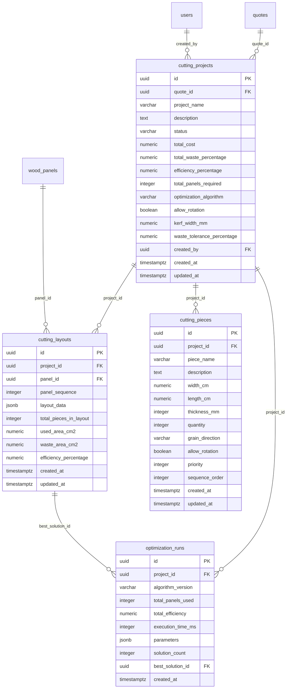
```mermaid
erDiagram
    cutting_projects {
        uuid id PK
        uuid quote_id FK
        varchar project_name
        text description
        varchar status
        numeric total_cost
        numeric total_waste_percentage
        numeric efficiency_percentage
        integer total_panels_required
        varchar optimization_algorithm
        boolean allow_rotation
        numeric kerf_width_mm
        numeric waste_tolerance_percentage
        uuid created_by FK
        timestamptz created_at
        timestamptz updated_at
    }

    cutting_layouts {
        uuid id PK
        uuid project_id FK
        uuid panel_id FK
        integer panel_sequence
        jsonb layout_data
        integer total_pieces_in_layout
        numeric used_area_cm2
        numeric waste_area_cm2
        numeric efficiency_percentage
        timestamptz created_at
        timestamptz updated_at
    }

    cutting_pieces {
        uuid id PK
        uuid project_id FK
        varchar piece_name
        text description
        numeric width_cm
        numeric length_cm
        integer thickness_mm
        integer quantity
        varchar grain_direction
        boolean allow_rotation
        integer priority
        integer sequence_order
        timestamptz created_at
        timestamptz updated_at
    }

    optimization_runs {
        uuid id PK
        uuid project_id FK
        varchar algorithm_version
        integer total_panels_used
        numeric total_efficiency
        integer execution_time_ms
        jsonb parameters
        integer solution_count
        uuid best_solution_id FK
        timestamptz created_at
    }

    %% ---------- Relaciones ----------
    wood_panels ||--o{ cutting_layouts : "panel_id"
    cutting_projects ||--o{ cutting_layouts : "project_id"
    cutting_projects ||--o{ cutting_pieces : "project_id"
    users ||--o{ cutting_projects : "created_by"
    quotes ||--o{ cutting_projects : "quote_id"
    cutting_layouts ||--o{ optimization_runs : "best_solution_id"
    cutting_projects ||--o{ optimization_runs : "project_id"

```

Proveedores y Compras

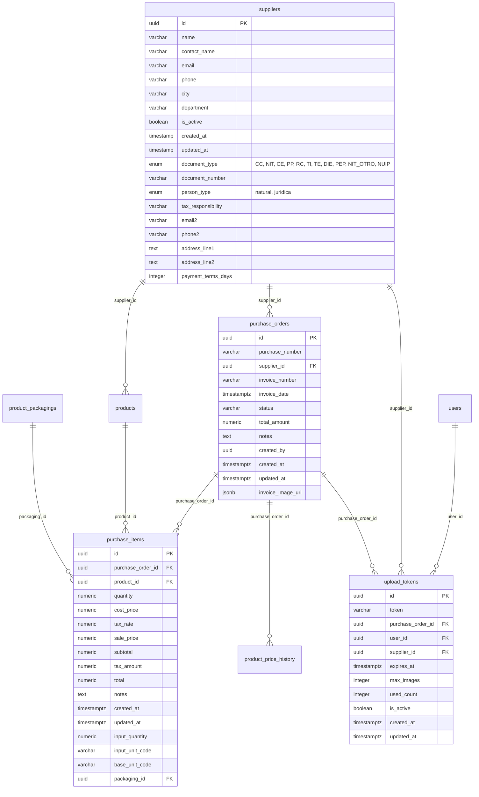
```mermaid
erDiagram

    suppliers {
        uuid id PK
        varchar name
        varchar contact_name
        varchar email
        varchar phone
        varchar city
        varchar department
        boolean is_active
        timestamp created_at
        timestamp updated_at
        enum document_type "CC, NIT, CE, PP, RC, TI, TE, DIE, PEP, NIT_OTRO, NUIP"
        varchar document_number
        enum person_type "natural, juridica"
        varchar tax_responsibility
        varchar email2
        varchar phone2
        text address_line1
        text address_line2
        integer payment_terms_days
    }

    purchase_orders {
        uuid id PK
        varchar purchase_number
        uuid supplier_id FK
        varchar invoice_number
        timestamptz invoice_date
        varchar status
        numeric total_amount
        text notes
        uuid created_by
        timestamptz created_at
        timestamptz updated_at
        jsonb invoice_image_url
    }

    purchase_items {
        uuid id PK
        uuid purchase_order_id FK
        uuid product_id FK
        numeric quantity
        numeric cost_price
        numeric tax_rate
        numeric sale_price
        numeric subtotal
        numeric tax_amount
        numeric total
        text notes
        timestamptz created_at
        timestamptz updated_at
        numeric input_quantity
        varchar input_unit_code
        varchar base_unit_code
        uuid packaging_id FK
    }

    upload_tokens {
        uuid id PK
        varchar token
        uuid purchase_order_id FK
        uuid user_id FK
        uuid supplier_id FK
        timestamptz expires_at
        integer max_images
        integer used_count
        boolean is_active
        timestamptz created_at
        timestamptz updated_at
    }

    %% ---------- Relaciones ----------
    purchase_orders ||--o{ product_price_history : "purchase_order_id"
    suppliers ||--o{ products : "supplier_id"
    product_packagings ||--o{ purchase_items : "packaging_id"
    products ||--o{ purchase_items : "product_id"
    purchase_orders ||--o{ purchase_items : "purchase_order_id"
    suppliers ||--o{ purchase_orders : "supplier_id"
    purchase_orders ||--o{ upload_tokens : "purchase_order_id"
    suppliers ||--o{ upload_tokens : "supplier_id"
    users ||--o{ upload_tokens : "user_id"

```

Inventario

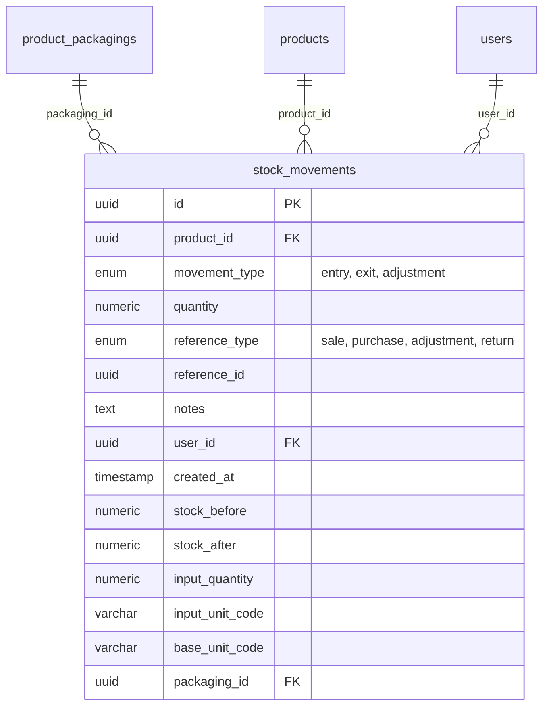
```mermaid
erDiagram

    stock_movements {
        uuid id PK
        uuid product_id FK
        enum movement_type "entry, exit, adjustment"
        numeric quantity
        enum reference_type "sale, purchase, adjustment, return"
        uuid reference_id
        text notes
        uuid user_id FK
        timestamp created_at
        numeric stock_before
        numeric stock_after
        numeric input_quantity
        varchar input_unit_code
        varchar base_unit_code
        uuid packaging_id FK
    }

    %% ---------- Relaciones ----------
    product_packagings ||--o{ stock_movements : "packaging_id"
    products ||--o{ stock_movements : "product_id"
    users ||--o{ stock_movements : "user_id"

```

Clientes

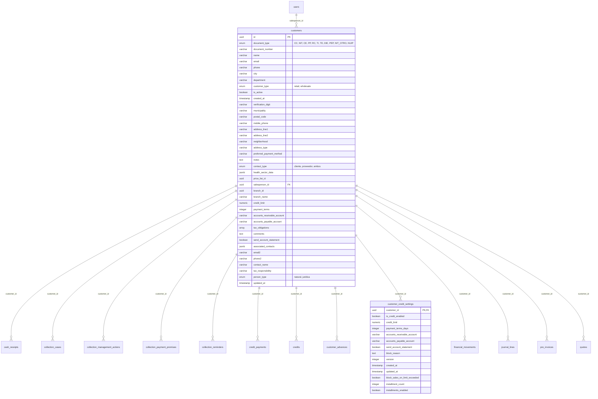
```mermaid
erDiagram

    customers {
        uuid id PK
        enum document_type "CC, NIT, CE, PP, RC, TI, TE, DIE, PEP, NIT_OTRO, NUIP"
        varchar document_number
        varchar name
        varchar email
        varchar phone
        varchar city
        varchar department
        enum customer_type "retail, wholesale"
        boolean is_active
        timestamp created_at
        varchar verification_digit
        varchar municipality
        varchar postal_code
        varchar mobile_phone
        varchar address_line1
        varchar address_line2
        varchar neighborhood
        varchar address_type
        varchar preferred_payment_method
        text notes
        enum contact_type "cliente, proveedor, ambos"
        jsonb health_sector_data
        uuid price_list_id
        uuid salesperson_id FK
        uuid branch_id
        varchar branch_name
        numeric credit_limit
        integer payment_terms
        varchar accounts_receivable_account
        varchar accounts_payable_account
        array tax_obligations
        text comments
        boolean send_account_statement
        jsonb associated_contacts
        varchar email2
        varchar phone2
        varchar contact_name
        varchar tax_responsibility
        enum person_type "natural, juridica"
        timestamp updated_at
    }

    customer_credit_settings {
        uuid customer_id PK,FK
        boolean is_credit_enabled
        numeric credit_limit
        integer payment_terms_days
        varchar accounts_receivable_account
        varchar accounts_payable_account
        boolean send_account_statement
        text block_reason
        integer version
        timestamp created_at
        timestamp updated_at
        boolean block_sales_on_limit_exceeded
        integer installment_count
        boolean installments_enabled
    }

    %% ---------- Relaciones ----------
    customers ||--o{ cash_receipts : "customer_id"
    customers ||--o{ collection_cases : "customer_id"
    customers ||--o{ collection_management_actions : "customer_id"
    customers ||--o{ collection_payment_promises : "customer_id"
    customers ||--o{ collection_reminders : "customer_id"
    customers ||--o{ credit_payments : "customer_id"
    customers ||--o{ credits : "customer_id"
    customers ||--o{ customer_advances : "customer_id"
    customers ||--o{ customer_credit_settings : "customer_id"
    users ||--o{ customers : "salesperson_id"
    customers ||--o{ financial_movements : "customer_id"
    customers ||--o{ journal_lines : "customer_id"
    customers ||--o{ pre_invoices : "customer_id"
    customers ||--o{ quotes : "customer_id"

```

Cotizaciones

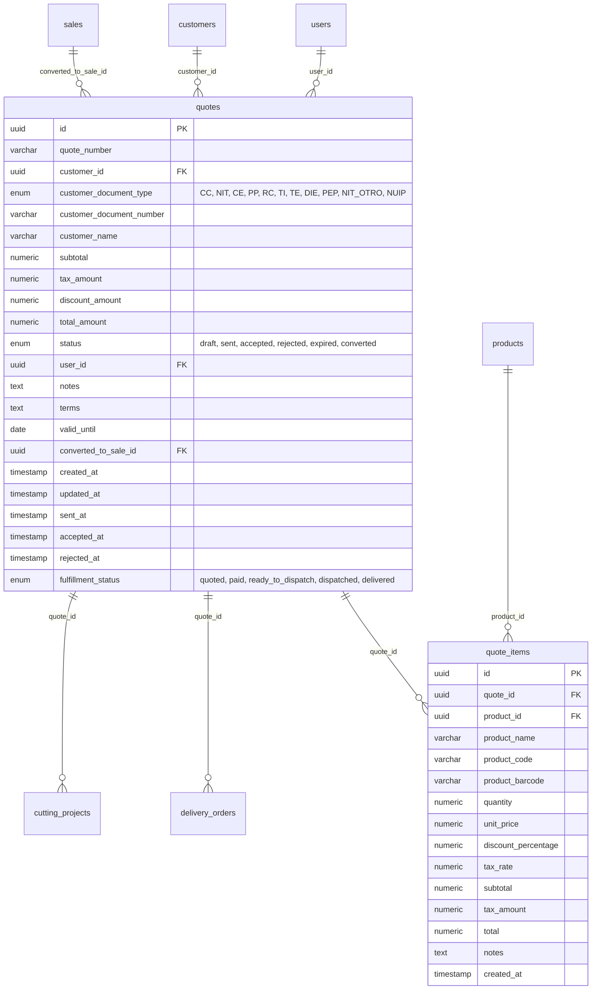
```mermaid
erDiagram

    quotes {
        uuid id PK
        varchar quote_number
        uuid customer_id FK
        enum customer_document_type "CC, NIT, CE, PP, RC, TI, TE, DIE, PEP, NIT_OTRO, NUIP"
        varchar customer_document_number
        varchar customer_name
        numeric subtotal
        numeric tax_amount
        numeric discount_amount
        numeric total_amount
        enum status "draft, sent, accepted, rejected, expired, converted"
        uuid user_id FK
        text notes
        text terms
        date valid_until
        uuid converted_to_sale_id FK
        timestamp created_at
        timestamp updated_at
        timestamp sent_at
        timestamp accepted_at
        timestamp rejected_at
        enum fulfillment_status "quoted, paid, ready_to_dispatch, dispatched, delivered"
    }

    quote_items {
        uuid id PK
        uuid quote_id FK
        uuid product_id FK
        varchar product_name
        varchar product_code
        varchar product_barcode
        numeric quantity
        numeric unit_price
        numeric discount_percentage
        numeric tax_rate
        numeric subtotal
        numeric tax_amount
        numeric total
        text notes
        timestamp created_at
    }

    %% ---------- Relaciones ----------
    quotes ||--o{ cutting_projects : "quote_id"
    quotes ||--o{ delivery_orders : "quote_id"
    products ||--o{ quote_items : "product_id"
    quotes ||--o{ quote_items : "quote_id"
    sales ||--o{ quotes : "converted_to_sale_id"
    customers ||--o{ quotes : "customer_id"
    users ||--o{ quotes : "user_id"

```

Ventas

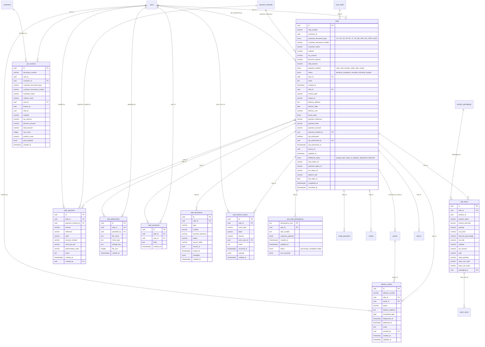
```mermaid
erDiagram

    sales {
        uuid id PK
        varchar sale_number
        uuid customer_id
        enum customer_document_type "CC, NIT, CE, PP, RC, TI, TE, DIE, PEP, NIT_OTRO, NUIP"
        varchar customer_document_number
        varchar customer_name
        numeric subtotal
        numeric tax_amount
        numeric discount_amount
        numeric total_amount
        enum payment_method "cash, card, transfer, credit, other, mixed"
        enum status "pending, completed, cancelled, refunded, anulado"
        uuid user_id FK
        text notes
        timestamp created_at
        uuid shift_id FK
        varchar invoice_type
        varchar unique_id
        text delivery_address
        date delivery_date
        numeric delivery_cost
        jsonb factus_data
        varchar payment_reference
        varchar payment_bank
        varchar payment_account
        uuid payment_method_id FK
        boolean otp_authorized
        uuid otp_authorized_by FK
        timestamptz otp_authorized_at
        uuid branch_id
        timestamp updated_at
        enum fulfillment_status "quoted, paid, ready_to_dispatch, dispatched, delivered"
        varchar sale_status_v2
        varchar payment_status_v2
        varchar tax_status_v2
        numeric balance_due
        date due_date_v2
        timestamptz completed_at
        timestamptz cancelled_at
    }

    sale_items {
        uuid id PK
        uuid sale_id FK
        uuid product_id
        varchar product_name
        varchar product_barcode
        numeric quantity
        numeric unit_price
        numeric discount_percentage
        numeric tax_rate
        numeric subtotal
        numeric tax_amount
        numeric total
        numeric input_quantity
        varchar input_unit_code
        varchar base_unit_code
        uuid packaging_id FK
    }

    sale_payments {
        uuid id PK
        uuid sale_id FK
        uuid payment_method_id FK
        numeric amount
        varchar reference
        varchar bank
        varchar account_number
        varchar card_last_four
        varchar authorization_code
        text notes
        timestamptz created_at
        uuid created_by FK
    }

    sale_attachments {
        uuid id PK
        uuid sale_id FK
        uuid uploaded_by FK
        text file_name
        text mime_type
        text storage_key
        integer file_size
        timestamptz created_at
    }

    sale_comments {
        uuid id PK
        uuid sale_id FK
        uuid user_id FK
        text body
        timestamptz created_at
    }

    sale_documents {
        uuid id PK
        uuid sale_id FK
        varchar type
        varchar number
        varchar external_reference
        varchar status
        varchar source_table
        uuid source_id
        timestamptz issued_at
        jsonb metadata
        timestamptz created_at
    }

    sale_timeline_events {
        uuid id PK
        uuid sale_id FK
        varchar event_type
        varchar label
        numeric amount
        uuid actor_user_id FK
        text notes
        timestamptz occurred_at
        jsonb payload
        timestamptz created_at
    }

    pos_sale_idempotency {
        text idempotency_key PK
        uuid sale_id FK
        text sale_number
        jsonb response_payload
        timestamptz created_at
        timestamptz updated_at
        enum status "processing, completed, failed"
        jsonb error_payload
    }

    delivery_orders {
        uuid id PK
        varchar delivery_number
        uuid sale_id FK
        uuid quote_id FK
        varchar status
        text delivery_address
        date scheduled_date
        timestamp dispatched_at
        timestamp delivered_at
        text notes
        uuid created_by FK
        timestamp created_at
        timestamp updated_at
    }

    pre_invoices {
        uuid id PK
        varchar document_number
        uuid cart_id
        uuid customer_id FK
        varchar customer_document_type
        varchar customer_document_number
        varchar customer_name
        varchar cashier_name
        uuid user_id FK
        uuid branch_id
        uuid shift_id
        numeric subtotal
        numeric tax_amount
        numeric discount_amount
        numeric total_amount
        integer line_count
        numeric product_count
        jsonb print_payload
        timestamp created_at
    }

    %% ---------- Relaciones ----------
    sales ||--o{ credit_payments : "sale_id"
    sales ||--o{ credits : "sale_id"
    users ||--o{ delivery_orders : "created_by"
    quotes ||--o{ delivery_orders : "quote_id"
    sales ||--o{ delivery_orders : "sale_id"
    sales ||--o{ pos_sale_idempotency : "sale_id"
    customers ||--o{ pre_invoices : "customer_id"
    users ||--o{ pre_invoices : "user_id"
    sales ||--o{ quotes : "converted_to_sale_id"
    sale_items ||--o{ return_items : "sale_item_id"
    sales ||--o{ returns : "sale_id"
    sales ||--o{ sale_attachments : "sale_id"
    users ||--o{ sale_attachments : "uploaded_by"
    sales ||--o{ sale_comments : "sale_id"
    users ||--o{ sale_comments : "user_id"
    sales ||--o{ sale_documents : "sale_id"
    product_packagings ||--o{ sale_items : "packaging_id"
    sales ||--o{ sale_items : "sale_id"
    users ||--o{ sale_payments : "created_by"
    payment_methods ||--o{ sale_payments : "payment_method_id"
    sales ||--o{ sale_payments : "sale_id"
    users ||--o{ sale_timeline_events : "actor_user_id"
    sales ||--o{ sale_timeline_events : "sale_id"
    users ||--o{ sales : "otp_authorized_by"
    payment_methods ||--o{ sales : "payment_method_id"
    cash_shifts ||--o{ sales : "shift_id"
    users ||--o{ sales : "user_id"

```

Devoluciones

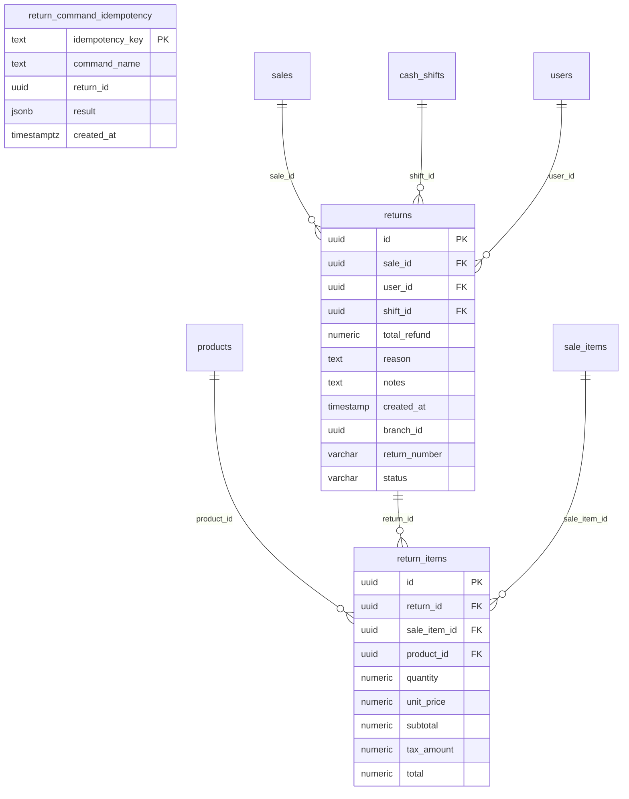
```mermaid
erDiagram

    returns {
        uuid id PK
        uuid sale_id FK
        uuid user_id FK
        uuid shift_id FK
        numeric total_refund
        text reason
        text notes
        timestamp created_at
        uuid branch_id
        varchar return_number
        varchar status
    }

    return_items {
        uuid id PK
        uuid return_id FK
        uuid sale_item_id FK
        uuid product_id FK
        numeric quantity
        numeric unit_price
        numeric subtotal
        numeric tax_amount
        numeric total
    }

    return_command_idempotency {
        text idempotency_key PK
        text command_name
        uuid return_id
        jsonb result
        timestamptz created_at
    }

    %% ---------- Relaciones ----------
    products ||--o{ return_items : "product_id"
    returns ||--o{ return_items : "return_id"
    sale_items ||--o{ return_items : "sale_item_id"
    sales ||--o{ returns : "sale_id"
    cash_shifts ||--o{ returns : "shift_id"
    users ||--o{ returns : "user_id"

```

Cartera y Credito

```mermaid
erDiagram

    credits {
        uuid id PK
        varchar credit_number
        uuid sale_id FK
        uuid customer_id FK
        numeric principal_amount
        numeric balance
        numeric interest_rate
        date due_date
        enum status "open, paid, overdue, cancelled, pending_approval, partially_paid, legal_collection, disputed, written_off, refinanced, suspended"
        uuid created_by FK
        timestamp created_at
        timestamp updated_at
    }

    credit_installments {
        uuid id PK
        uuid credit_id FK
        integer installment_number
        numeric principal_amount
        numeric balance
        date due_date
        enum status "pending, partial, paid, overdue, cancelled"
        timestamp paid_at
        timestamp created_at
        timestamp updated_at
    }

    credit_history {
        uuid id PK
        uuid credit_id FK
        enum event_type "created, payment, payment_reversed, status_changed, overdue_marked, sale_return, limit_increased, limit_decreased, term_changed, rate_changed, payment_agreement, collection_action, refinanced, written_off, note"
        numeric amount
        numeric balance_before
        numeric balance_after
        varchar reference_type
        uuid reference_id
        text notes
        uuid user_id FK
        timestamp created_at
    }

    credit_payments {
        uuid id PK
        uuid sale_id FK
        uuid customer_id FK
        numeric amount
        timestamp payment_date
        text notes
        uuid created_by FK
        timestamp created_at
        timestamp updated_at
        uuid credit_id FK
        boolean is_reversed
        timestamp reversed_at
        uuid reversed_by FK
        text reversal_reason
        uuid payment_method_id FK
        uuid cash_receipt_id FK
    }

    credit_notes {
        uuid id PK
        uuid electronic_invoice_id
        integer factus_bill_id
        varchar factus_number
        varchar cufe
        varchar status
        integer numbering_range_id
        varchar reference_code
        integer correction_concept_code
        integer customization_id
        varchar payment_method_code
        text observation
        boolean send_email
        jsonb factus_response
        uuid sale_return_id
        uuid branch_id
        timestamp created_at
    }

    customer_advances {
        uuid id PK
        uuid customer_id FK
        uuid cash_receipt_id FK
        numeric original_amount
        numeric available_amount
        enum status "available, partially_applied, fully_applied, void"
        text notes
        uuid created_by FK
        timestamptz voided_at
        uuid voided_by FK
        text void_reason
        timestamptz created_at
        timestamptz updated_at
    }

    customer_advance_applications {
        uuid id PK
        uuid advance_id FK
        uuid credit_id FK
        numeric applied_amount
        uuid credit_payment_id
        uuid created_by FK
        timestamptz created_at
    }

    cash_receipts {
        uuid id PK
        varchar number
        uuid customer_id FK
        enum status "draft, posted, voided"
        uuid payment_method_id FK
        numeric total_amount
        text notes
        uuid created_by FK
        timestamp posted_at
        timestamp voided_at
        uuid voided_by FK
        text void_reason
        timestamp created_at
        timestamp updated_at
    }

    cash_receipt_applications {
        uuid id PK
        uuid receipt_id FK
        uuid credit_id FK
        numeric applied_amount
        timestamp created_at
    }

    cash_receipt_history {
        uuid id PK
        uuid receipt_id FK
        varchar action
        jsonb payload
        uuid user_id FK
        timestamp created_at
    }

    %% ---------- Relaciones ----------
    cash_receipts ||--o{ bank_reconciliation_matches : "cash_receipt_id"
    credits ||--o{ cash_receipt_applications : "credit_id"
    cash_receipts ||--o{ cash_receipt_applications : "receipt_id"
    cash_receipts ||--o{ cash_receipt_history : "receipt_id"
    users ||--o{ cash_receipt_history : "user_id"
    users ||--o{ cash_receipts : "created_by"
    customers ||--o{ cash_receipts : "customer_id"
    payment_methods ||--o{ cash_receipts : "payment_method_id"
    users ||--o{ cash_receipts : "voided_by"
    credits ||--o{ credit_history : "credit_id"
    users ||--o{ credit_history : "user_id"
    credits ||--o{ credit_installments : "credit_id"
    cash_receipts ||--o{ credit_payments : "cash_receipt_id"
    users ||--o{ credit_payments : "created_by"
    credits ||--o{ credit_payments : "credit_id"
    customers ||--o{ credit_payments : "customer_id"
    payment_methods ||--o{ credit_payments : "payment_method_id"
    users ||--o{ credit_payments : "reversed_by"
    sales ||--o{ credit_payments : "sale_id"
    users ||--o{ credits : "created_by"
    customers ||--o{ credits : "customer_id"
    sales ||--o{ credits : "sale_id"
    customer_advances ||--o{ customer_advance_applications : "advance_id"
    users ||--o{ customer_advance_applications : "created_by"
    credits ||--o{ customer_advance_applications : "credit_id"
    cash_receipts ||--o{ customer_advances : "cash_receipt_id"
    users ||--o{ customer_advances : "created_by"
    customers ||--o{ customer_advances : "customer_id"
    users ||--o{ customer_advances : "voided_by"

```

Cobranza

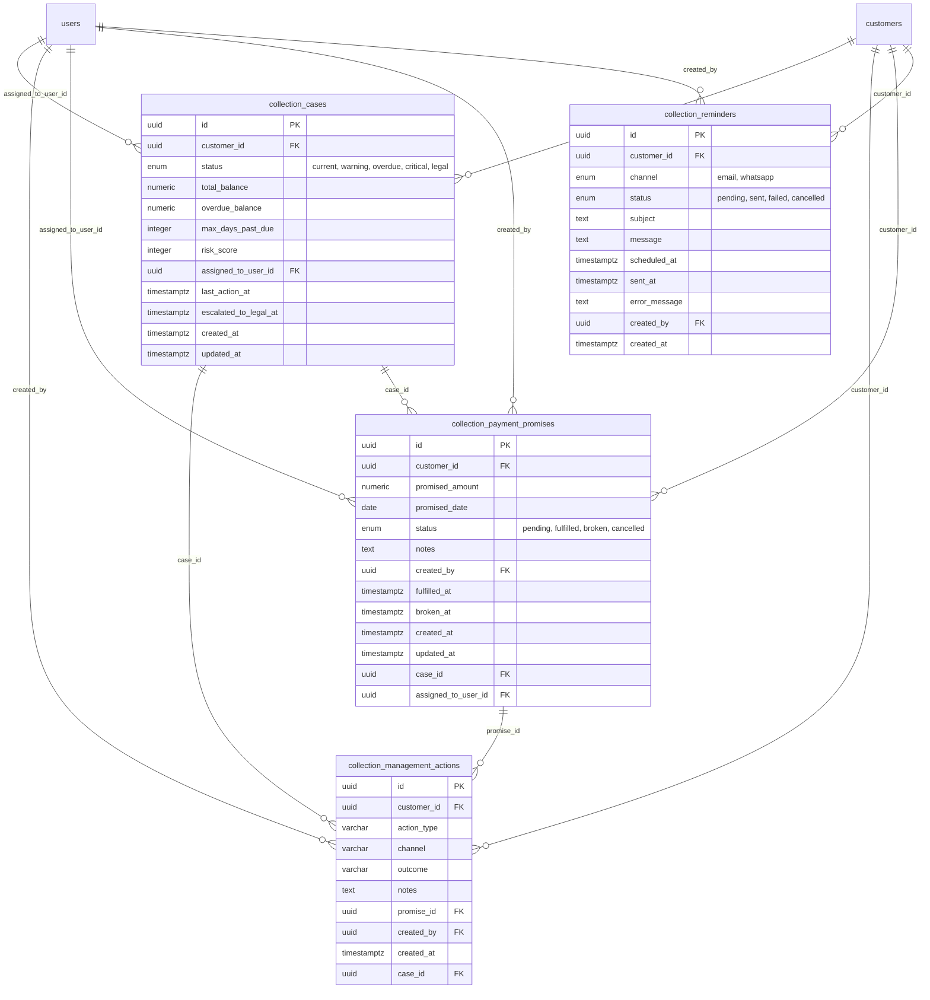
```mermaid
erDiagram

    collection_cases {
        uuid id PK
        uuid customer_id FK
        enum status "current, warning, overdue, critical, legal"
        numeric total_balance
        numeric overdue_balance
        integer max_days_past_due
        integer risk_score
        uuid assigned_to_user_id FK
        timestamptz last_action_at
        timestamptz escalated_to_legal_at
        timestamptz created_at
        timestamptz updated_at
    }

    collection_management_actions {
        uuid id PK
        uuid customer_id FK
        varchar action_type
        varchar channel
        varchar outcome
        text notes
        uuid promise_id FK
        uuid created_by FK
        timestamptz created_at
        uuid case_id FK
    }

    collection_payment_promises {
        uuid id PK
        uuid customer_id FK
        numeric promised_amount
        date promised_date
        enum status "pending, fulfilled, broken, cancelled"
        text notes
        uuid created_by FK
        timestamptz fulfilled_at
        timestamptz broken_at
        timestamptz created_at
        timestamptz updated_at
        uuid case_id FK
        uuid assigned_to_user_id FK
    }

    collection_reminders {
        uuid id PK
        uuid customer_id FK
        enum channel "email, whatsapp"
        enum status "pending, sent, failed, cancelled"
        text subject
        text message
        timestamptz scheduled_at
        timestamptz sent_at
        text error_message
        uuid created_by FK
        timestamptz created_at
    }

    %% ---------- Relaciones ----------
    users ||--o{ collection_cases : "assigned_to_user_id"
    customers ||--o{ collection_cases : "customer_id"
    collection_cases ||--o{ collection_management_actions : "case_id"
    users ||--o{ collection_management_actions : "created_by"
    customers ||--o{ collection_management_actions : "customer_id"
    collection_payment_promises ||--o{ collection_management_actions : "promise_id"
    users ||--o{ collection_payment_promises : "assigned_to_user_id"
    collection_cases ||--o{ collection_payment_promises : "case_id"
    users ||--o{ collection_payment_promises : "created_by"
    customers ||--o{ collection_payment_promises : "customer_id"
    users ||--o{ collection_reminders : "created_by"
    customers ||--o{ collection_reminders : "customer_id"

```

Caja y Tesoreria

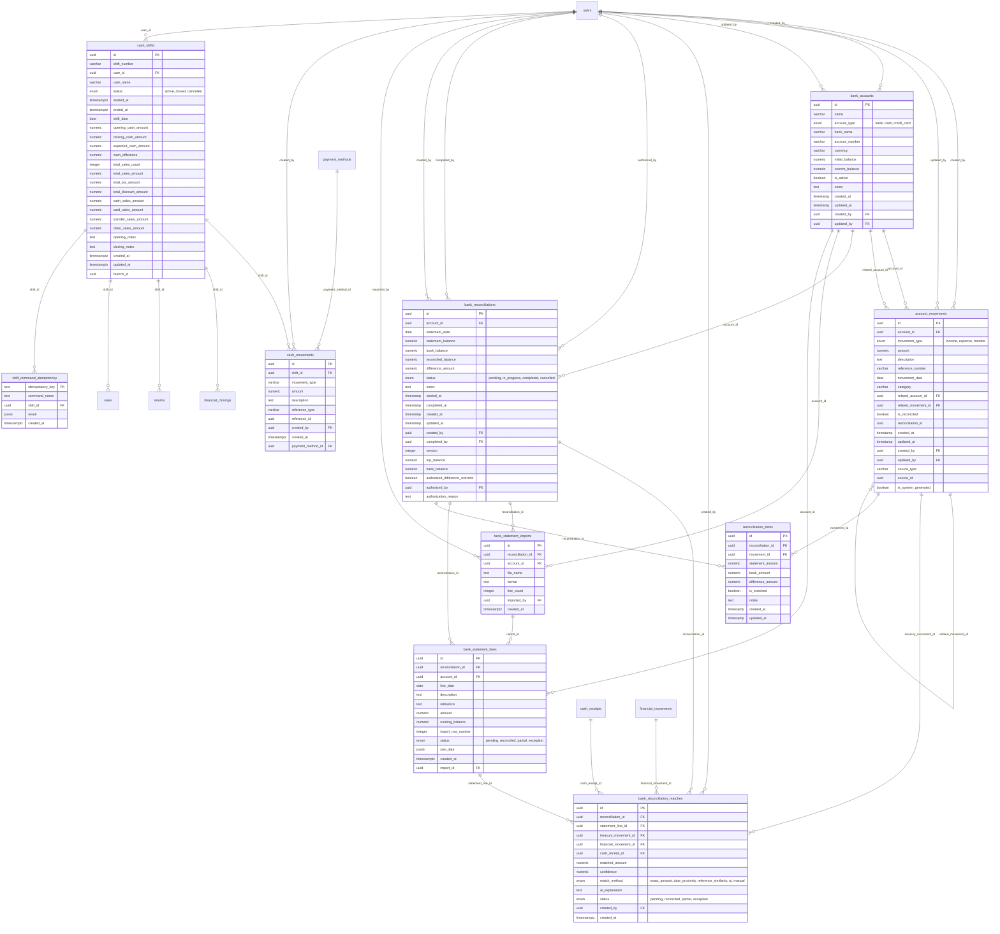
```mermaid
erDiagram

    cash_shifts {
        uuid id PK
        varchar shift_number
        uuid user_id FK
        varchar user_name
        enum status "active, closed, cancelled"
        timestamptz started_at
        timestamptz ended_at
        date shift_date
        numeric opening_cash_amount
        numeric closing_cash_amount
        numeric expected_cash_amount
        numeric cash_difference
        integer total_sales_count
        numeric total_sales_amount
        numeric total_tax_amount
        numeric total_discount_amount
        numeric cash_sales_amount
        numeric card_sales_amount
        numeric transfer_sales_amount
        numeric other_sales_amount
        text opening_notes
        text closing_notes
        timestamptz created_at
        timestamptz updated_at
        uuid branch_id
    }

    cash_movements {
        uuid id PK
        uuid shift_id FK
        varchar movement_type
        numeric amount
        text description
        varchar reference_type
        uuid reference_id
        uuid created_by FK
        timestamptz created_at
        uuid payment_method_id FK
    }

    shift_command_idempotency {
        text idempotency_key PK
        text command_name
        uuid shift_id FK
        jsonb result
        timestamptz created_at
    }

    bank_accounts {
        uuid id PK
        varchar name
        enum account_type "bank, cash, credit_card"
        varchar bank_name
        varchar account_number
        varchar currency
        numeric initial_balance
        numeric current_balance
        boolean is_active
        text notes
        timestamp created_at
        timestamp updated_at
        uuid created_by FK
        uuid updated_by FK
    }

    bank_reconciliations {
        uuid id PK
        uuid account_id FK
        date statement_date
        numeric statement_balance
        numeric book_balance
        numeric reconciled_balance
        numeric difference_amount
        enum status "pending, in_progress, completed, cancelled"
        text notes
        timestamp started_at
        timestamp completed_at
        timestamp created_at
        timestamp updated_at
        uuid created_by FK
        uuid completed_by FK
        integer version
        numeric erp_balance
        numeric bank_balance
        boolean authorized_difference_override
        uuid authorized_by FK
        text authorization_reason
    }

    bank_reconciliation_matches {
        uuid id PK
        uuid reconciliation_id FK
        uuid statement_line_id FK
        uuid treasury_movement_id FK
        uuid financial_movement_id FK
        uuid cash_receipt_id FK
        numeric matched_amount
        numeric confidence
        enum match_method "exact_amount, date_proximity, reference_similarity, ai, manual"
        text ai_explanation
        enum status "pending, reconciled, partial, exception"
        uuid created_by FK
        timestamptz created_at
    }

    bank_statement_imports {
        uuid id PK
        uuid reconciliation_id FK
        uuid account_id FK
        text file_name
        text format
        integer line_count
        uuid imported_by FK
        timestamptz created_at
    }

    bank_statement_lines {
        uuid id PK
        uuid reconciliation_id FK
        uuid account_id FK
        date line_date
        text description
        text reference
        numeric amount
        numeric running_balance
        integer import_row_number
        enum status "pending, reconciled, partial, exception"
        jsonb raw_data
        timestamptz created_at
        uuid import_id FK
    }

    account_movements {
        uuid id PK
        uuid account_id FK
        enum movement_type "income, expense, transfer"
        numeric amount
        text description
        varchar reference_number
        date movement_date
        varchar category
        uuid related_account_id FK
        uuid related_movement_id FK
        boolean is_reconciled
        uuid reconciliation_id
        timestamp created_at
        timestamp updated_at
        uuid created_by FK
        uuid updated_by FK
        varchar source_type
        uuid source_id
        boolean is_system_generated
    }

    reconciliation_items {
        uuid id PK
        uuid reconciliation_id FK
        uuid movement_id FK
        numeric statement_amount
        numeric book_amount
        numeric difference_amount
        boolean is_matched
        text notes
        timestamp created_at
        timestamp updated_at
    }

    %% ---------- Relaciones ----------
    bank_accounts ||--o{ account_movements : "account_id"
    users ||--o{ account_movements : "created_by"
    bank_accounts ||--o{ account_movements : "related_account_id"
    account_movements ||--o{ account_movements : "related_movement_id"
    users ||--o{ account_movements : "updated_by"
    users ||--o{ bank_accounts : "created_by"
    users ||--o{ bank_accounts : "updated_by"
    cash_receipts ||--o{ bank_reconciliation_matches : "cash_receipt_id"
    users ||--o{ bank_reconciliation_matches : "created_by"
    financial_movements ||--o{ bank_reconciliation_matches : "financial_movement_id"
    bank_reconciliations ||--o{ bank_reconciliation_matches : "reconciliation_id"
    bank_statement_lines ||--o{ bank_reconciliation_matches : "statement_line_id"
    account_movements ||--o{ bank_reconciliation_matches : "treasury_movement_id"
    bank_accounts ||--o{ bank_reconciliations : "account_id"
    users ||--o{ bank_reconciliations : "authorized_by"
    users ||--o{ bank_reconciliations : "completed_by"
    users ||--o{ bank_reconciliations : "created_by"
    bank_accounts ||--o{ bank_statement_imports : "account_id"
    users ||--o{ bank_statement_imports : "imported_by"
    bank_reconciliations ||--o{ bank_statement_imports : "reconciliation_id"
    bank_accounts ||--o{ bank_statement_lines : "account_id"
    bank_statement_imports ||--o{ bank_statement_lines : "import_id"
    bank_reconciliations ||--o{ bank_statement_lines : "reconciliation_id"
    payment_methods ||--o{ cash_movements : "payment_method_id"
    users ||--o{ cash_movements : "created_by"
    cash_shifts ||--o{ cash_movements : "shift_id"
    users ||--o{ cash_shifts : "user_id"
    cash_shifts ||--o{ financial_closings : "shift_id"
    account_movements ||--o{ reconciliation_items : "movement_id"
    bank_reconciliations ||--o{ reconciliation_items : "reconciliation_id"
    cash_shifts ||--o{ returns : "shift_id"
    cash_shifts ||--o{ sales : "shift_id"
    cash_shifts ||--o{ shift_command_idempotency : "shift_id"

```

Contabilidad

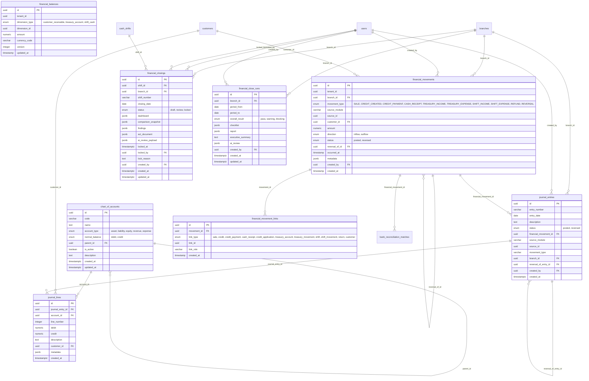
```mermaid
erDiagram

    chart_of_accounts {
        uuid id PK
        varchar code
        text name
        enum account_type "asset, liability, equity, revenue, expense"
        enum normal_balance "debit, credit"
        uuid parent_id FK
        boolean is_active
        text description
        timestamptz created_at
        timestamptz updated_at
    }

    journal_entries {
        uuid id PK
        varchar entry_number
        date entry_date
        text description
        enum status "posted, reversed"
        uuid financial_movement_id FK
        varchar source_module
        uuid source_id
        varchar movement_type
        uuid branch_id FK
        uuid reversal_of_entry_id FK
        uuid created_by FK
        timestamptz created_at
    }

    journal_lines {
        uuid id PK
        uuid journal_entry_id FK
        uuid account_id FK
        integer line_number
        numeric debit
        numeric credit
        text description
        uuid customer_id FK
        jsonb metadata
        timestamptz created_at
    }

    financial_movements {
        uuid id PK
        uuid tenant_id
        uuid branch_id FK
        enum movement_type "SALE, CREDIT_CREATED, CREDIT_PAYMENT, CASH_RECEIPT, TREASURY_INCOME, TREASURY_EXPENSE, SHIFT_INCOME, SHIFT_EXPENSE, REFUND, REVERSAL"
        varchar source_module
        uuid source_id
        uuid customer_id FK
        numeric amount
        enum direction "inflow, outflow"
        enum status "posted, reversed"
        uuid reversal_of_id FK
        timestamp occurred_at
        jsonb metadata
        uuid created_by FK
        timestamp created_at
    }

    financial_movement_links {
        uuid id PK
        uuid movement_id FK
        enum link_type "sale, credit, credit_payment, cash_receipt, credit_application, treasury_account, treasury_movement, shift, shift_movement, return, customer"
        uuid link_id
        varchar link_role
        timestamp created_at
    }

    financial_balances {
        uuid id PK
        uuid tenant_id
        enum dimension_type "customer_receivable, treasury_account, shift_cash"
        uuid dimension_id
        numeric amount
        varchar currency_code
        integer version
        timestamp updated_at
    }

    financial_closings {
        uuid id PK
        uuid shift_id FK
        uuid branch_id FK
        varchar shift_number
        date closing_date
        enum status "draft, review, locked"
        jsonb dashboard
        jsonb comparison_snapshot
        jsonb findings
        jsonb act_document
        jsonb ai_review_payload
        timestamptz locked_at
        uuid locked_by FK
        text lock_reason
        uuid created_by FK
        timestamptz created_at
        timestamptz updated_at
    }

    financial_close_runs {
        uuid id PK
        uuid branch_id FK
        date period_from
        date period_to
        enum overall_result "pass, warning, blocking"
        jsonb checklist
        jsonb report
        text executive_summary
        jsonb ai_review
        uuid created_by FK
        timestamptz created_at
        timestamptz updated_at
    }

    %% ---------- Relaciones ----------
    financial_movements ||--o{ bank_reconciliation_matches : "financial_movement_id"
    chart_of_accounts ||--o{ chart_of_accounts : "parent_id"
    branches ||--o{ financial_close_runs : "branch_id"
    users ||--o{ financial_close_runs : "created_by"
    branches ||--o{ financial_closings : "branch_id"
    users ||--o{ financial_closings : "created_by"
    users ||--o{ financial_closings : "locked_by"
    cash_shifts ||--o{ financial_closings : "shift_id"
    financial_movements ||--o{ financial_movement_links : "movement_id"
    branches ||--o{ financial_movements : "branch_id"
    users ||--o{ financial_movements : "created_by"
    customers ||--o{ financial_movements : "customer_id"
    financial_movements ||--o{ financial_movements : "reversal_of_id"
    branches ||--o{ journal_entries : "branch_id"
    users ||--o{ journal_entries : "created_by"
    financial_movements ||--o{ journal_entries : "financial_movement_id"
    journal_entries ||--o{ journal_entries : "reversal_of_entry_id"
    chart_of_accounts ||--o{ journal_lines : "account_id"
    customers ||--o{ journal_lines : "customer_id"
    journal_entries ||--o{ journal_lines : "journal_entry_id"

```

Facturacion Electronica

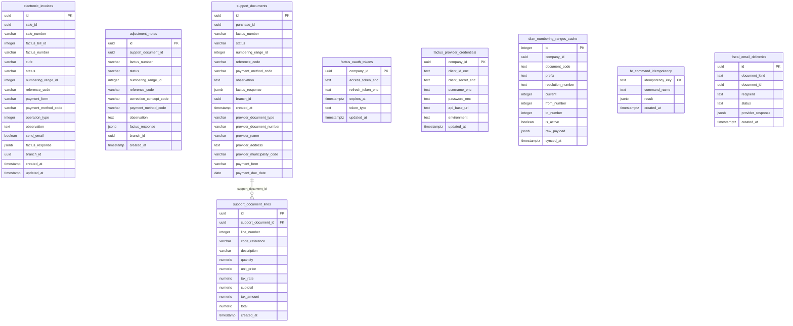
```mermaid
erDiagram

    electronic_invoices {
        uuid id PK
        uuid sale_id
        varchar sale_number
        integer factus_bill_id
        varchar factus_number
        varchar cufe
        varchar status
        integer numbering_range_id
        varchar reference_code
        varchar payment_form
        varchar payment_method_code
        integer operation_type
        text observation
        boolean send_email
        jsonb factus_response
        uuid branch_id
        timestamp created_at
        timestamp updated_at
    }

    adjustment_notes {
        uuid id PK
        uuid support_document_id
        varchar factus_number
        varchar status
        integer numbering_range_id
        varchar reference_code
        varchar correction_concept_code
        varchar payment_method_code
        text observation
        jsonb factus_response
        uuid branch_id
        timestamp created_at
    }

    support_documents {
        uuid id PK
        uuid purchase_id
        varchar factus_number
        varchar status
        integer numbering_range_id
        varchar reference_code
        varchar payment_method_code
        text observation
        jsonb factus_response
        uuid branch_id
        timestamp created_at
        varchar provider_document_type
        varchar provider_document_number
        varchar provider_name
        text provider_address
        varchar provider_municipality_code
        varchar payment_form
        date payment_due_date
    }

    support_document_lines {
        uuid id PK
        uuid support_document_id FK
        integer line_number
        varchar code_reference
        varchar description
        numeric quantity
        numeric unit_price
        numeric tax_rate
        numeric subtotal
        numeric tax_amount
        numeric total
        timestamp created_at
    }

    factus_oauth_tokens {
        uuid company_id PK
        text access_token_enc
        text refresh_token_enc
        timestamptz expires_at
        text token_type
        timestamptz updated_at
    }

    factus_provider_credentials {
        uuid company_id PK
        text client_id_enc
        text client_secret_enc
        text username_enc
        text password_enc
        text api_base_url
        text environment
        timestamptz updated_at
    }

    dian_numbering_ranges_cache {
        integer id PK
        uuid company_id
        text document_code
        text prefix
        text resolution_number
        integer current
        integer from_number
        integer to_number
        boolean is_active
        jsonb raw_payload
        timestamptz synced_at
    }

    fe_command_idempotency {
        text idempotency_key PK
        text command_name
        jsonb result
        timestamptz created_at
    }

    fiscal_email_deliveries {
        uuid id PK
        text document_kind
        uuid document_id
        text recipient
        text status
        jsonb provider_response
        timestamptz created_at
    }

    %% ---------- Relaciones ----------
    support_documents ||--o{ support_document_lines : "support_document_id"

```

Notificaciones y Correo

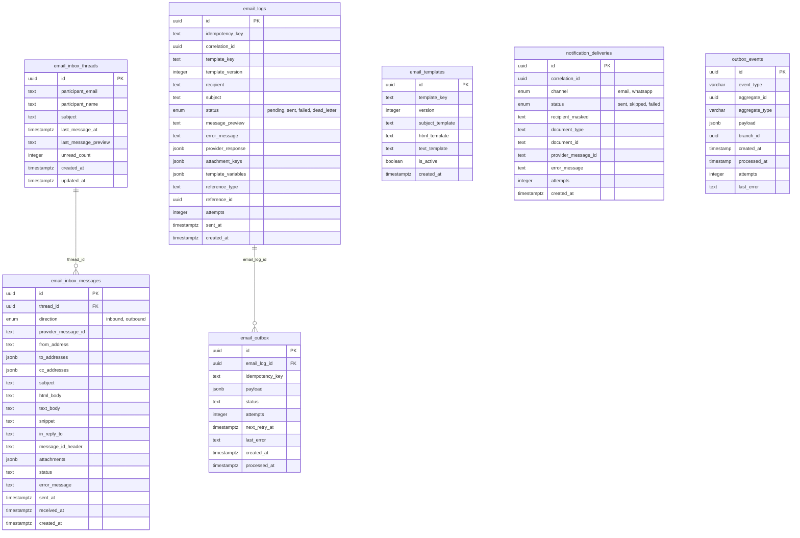
```mermaid
erDiagram

    email_inbox_threads {
        uuid id PK
        text participant_email
        text participant_name
        text subject
        timestamptz last_message_at
        text last_message_preview
        integer unread_count
        timestamptz created_at
        timestamptz updated_at
    }

    email_inbox_messages {
        uuid id PK
        uuid thread_id FK
        enum direction "inbound, outbound"
        text provider_message_id
        text from_address
        jsonb to_addresses
        jsonb cc_addresses
        text subject
        text html_body
        text text_body
        text snippet
        text in_reply_to
        text message_id_header
        jsonb attachments
        text status
        text error_message
        timestamptz sent_at
        timestamptz received_at
        timestamptz created_at
    }

    email_logs {
        uuid id PK
        text idempotency_key
        uuid correlation_id
        text template_key
        integer template_version
        text recipient
        text subject
        enum status "pending, sent, failed, dead_letter"
        text message_preview
        text error_message
        jsonb provider_response
        jsonb attachment_keys
        jsonb template_variables
        text reference_type
        uuid reference_id
        integer attempts
        timestamptz sent_at
        timestamptz created_at
    }

    email_outbox {
        uuid id PK
        uuid email_log_id FK
        text idempotency_key
        jsonb payload
        text status
        integer attempts
        timestamptz next_retry_at
        text last_error
        timestamptz created_at
        timestamptz processed_at
    }

    email_templates {
        uuid id PK
        text template_key
        integer version
        text subject_template
        text html_template
        text text_template
        boolean is_active
        timestamptz created_at
    }

    notification_deliveries {
        uuid id PK
        uuid correlation_id
        enum channel "email, whatsapp"
        enum status "sent, skipped, failed"
        text recipient_masked
        text document_type
        text document_id
        text provider_message_id
        text error_message
        integer attempts
        timestamptz created_at
    }

    outbox_events {
        uuid id PK
        varchar event_type
        uuid aggregate_id
        varchar aggregate_type
        jsonb payload
        uuid branch_id
        timestamp created_at
        timestamp processed_at
        integer attempts
        text last_error
    }

    %% ---------- Relaciones ----------
    email_inbox_threads ||--o{ email_inbox_messages : "thread_id"
    email_logs ||--o{ email_outbox : "email_log_id"

```

WhatsApp

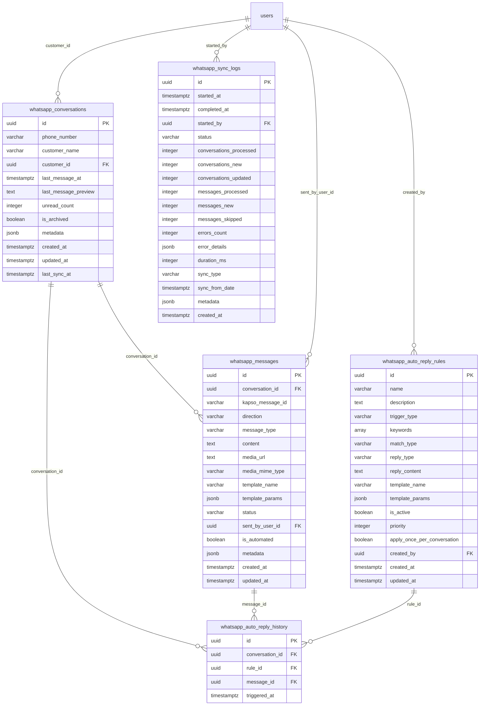
```mermaid
erDiagram

    whatsapp_conversations {
        uuid id PK
        varchar phone_number
        varchar customer_name
        uuid customer_id FK
        timestamptz last_message_at
        text last_message_preview
        integer unread_count
        boolean is_archived
        jsonb metadata
        timestamptz created_at
        timestamptz updated_at
        timestamptz last_sync_at
    }

    whatsapp_messages {
        uuid id PK
        uuid conversation_id FK
        varchar kapso_message_id
        varchar direction
        varchar message_type
        text content
        text media_url
        varchar media_mime_type
        varchar template_name
        jsonb template_params
        varchar status
        uuid sent_by_user_id FK
        boolean is_automated
        jsonb metadata
        timestamptz created_at
        timestamptz updated_at
    }

    whatsapp_auto_reply_rules {
        uuid id PK
        varchar name
        text description
        varchar trigger_type
        array keywords
        varchar match_type
        varchar reply_type
        text reply_content
        varchar template_name
        jsonb template_params
        boolean is_active
        integer priority
        boolean apply_once_per_conversation
        uuid created_by FK
        timestamptz created_at
        timestamptz updated_at
    }

    whatsapp_auto_reply_history {
        uuid id PK
        uuid conversation_id FK
        uuid rule_id FK
        uuid message_id FK
        timestamptz triggered_at
    }

    whatsapp_sync_logs {
        uuid id PK
        timestamptz started_at
        timestamptz completed_at
        uuid started_by FK
        varchar status
        integer conversations_processed
        integer conversations_new
        integer conversations_updated
        integer messages_processed
        integer messages_new
        integer messages_skipped
        integer errors_count
        jsonb error_details
        integer duration_ms
        varchar sync_type
        timestamptz sync_from_date
        jsonb metadata
        timestamptz created_at
    }

    %% ---------- Relaciones ----------
    whatsapp_conversations ||--o{ whatsapp_auto_reply_history : "conversation_id"
    whatsapp_messages ||--o{ whatsapp_auto_reply_history : "message_id"
    whatsapp_auto_reply_rules ||--o{ whatsapp_auto_reply_history : "rule_id"
    users ||--o{ whatsapp_auto_reply_rules : "created_by"
    users ||--o{ whatsapp_conversations : "customer_id"
    whatsapp_conversations ||--o{ whatsapp_messages : "conversation_id"
    users ||--o{ whatsapp_messages : "sent_by_user_id"
    users ||--o{ whatsapp_sync_logs : "started_by"

```

Tareas Internas

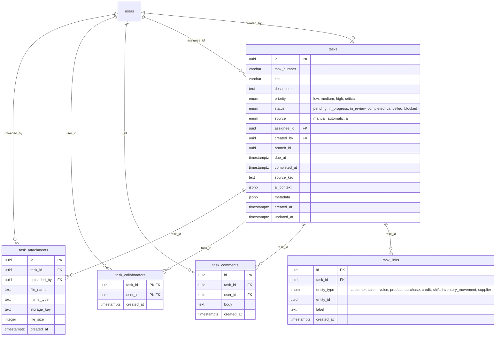
```mermaid
erDiagram

    tasks {
        uuid id PK
        varchar task_number
        varchar title
        text description
        enum priority "low, medium, high, critical"
        enum status "pending, in_progress, in_review, completed, cancelled, blocked"
        enum source "manual, automatic, ai"
        uuid assignee_id FK
        uuid created_by FK
        uuid branch_id
        timestamptz due_at
        timestamptz completed_at
        text source_key
        jsonb ai_context
        jsonb metadata
        timestamptz created_at
        timestamptz updated_at
    }

    task_attachments {
        uuid id PK
        uuid task_id FK
        uuid uploaded_by FK
        text file_name
        text mime_type
        text storage_key
        integer file_size
        timestamptz created_at
    }

    task_collaborators {
        uuid task_id PK,FK
        uuid user_id PK,FK
        timestamptz created_at
    }

    task_comments {
        uuid id PK
        uuid task_id FK
        uuid user_id FK
        text body
        timestamptz created_at
    }

    task_links {
        uuid id PK
        uuid task_id FK
        enum entity_type "customer, sale, invoice, product, purchase, credit, shift, inventory_movement, supplier"
        uuid entity_id
        text label
        timestamptz created_at
    }

    %% ---------- Relaciones ----------
    tasks ||--o{ task_attachments : "task_id"
    users ||--o{ task_attachments : "uploaded_by"
    tasks ||--o{ task_collaborators : "task_id"
    users ||--o{ task_collaborators : "user_id"
    tasks ||--o{ task_comments : "task_id"
    users ||--o{ task_comments : "_id"
    tasks ||--o{ task_links : "task_id"
    users ||--o{ tasks : "assignee_id"
    users ||--o{ tasks : "created_by"

```

Configuracion y Sucursales

```mermaid
erDiagram

    branches {
        uuid id PK
        varchar code
        varchar name
        varchar address
        varchar city
        varchar department
        varchar phone
        varchar email
        varchar timezone
        boolean is_headquarters
        boolean is_active
        timestamptz created_at
        timestamptz updated_at
        jsonb print_preferences
    }

    company_settings {
        uuid id PK
        varchar name
        varchar legal_name
        enum document_type "CC, NIT, CE, PP, RC, TI, TE, DIE, PEP, NIT_OTRO, NUIP"
        varchar identification_number
        varchar email
        varchar phone
        varchar address
        varchar city
        varchar department
        varchar postal_code
        varchar country
        enum tax_regime "simplificado, comun, gran_contribuyente, no_responsable, regimen_simple_tributacion, autorretenedor"
        varchar ciuu_code
        varchar logo_url
        boolean is_active
        timestamptz created_at
        timestamptz updated_at
        uuid branch_id FK
        integer factus_numbering_range_id
        integer factus_credit_note_range_id
        integer factus_support_doc_range_id
        varchar factus_municipality_id
        varchar website
    }

    system_settings {
        uuid id PK
        varchar key
        jsonb value
        varchar category
        text description
        integer version
        uuid updated_by FK
        timestamptz created_at
        timestamptz updated_at
    }

    features {
        uuid id
        varchar key
        varchar name
        text description
        boolean enabled
        varchar module
        timestamptz created_at
        timestamptz updated_at
    }

    tax_settings {
        uuid id PK
        uuid branch_id FK
        varchar label
        varchar regime
        uuid default_tax_id FK
        boolean retention_enabled
        numeric retention_rate
        boolean electronic_invoicing_enabled
        jsonb metadata
        boolean is_active
        integer version
        timestamptz created_at
        timestamptz updated_at
    }

    taxes {
        uuid id PK
        varchar name
        enum tax_type "IVA, ICA, Consumo, Retencion, Otro"
        numeric rate
        text description
        boolean is_creditable
        varchar sales_account
        varchar purchases_account
        varchar sales_return_account
        varchar purchases_return_account
        boolean is_active
        boolean is_system
        timestamptz created_at
        timestamptz updated_at
        uuid created_by FK
    }

    measurement_units {
        uuid id PK
        varchar code
        varchar name
        varchar symbol
        enum commercialization_type "UNIT, AREA, WEIGHT, LENGTH, VOLUME, BOX"
        boolean is_system
        boolean is_active
        integer sort_order
        timestamptz created_at
        timestamptz updated_at
        numeric factor_to_base
        boolean is_base
    }

    payment_methods {
        uuid id PK
        varchar name
        enum payment_type "Efectivo, Transferencia, TarjetaDebito, TarjetaCredito, Nequi, Daviplata, Otro, Cr_dito"
        text description
        boolean requires_reference
        boolean requires_bank
        boolean requires_account
        varchar bank_name
        varchar account_number
        varchar account_type
        boolean is_active
        boolean is_system
        boolean is_default
        timestamptz created_at
        timestamptz updated_at
        uuid created_by FK
        varchar icon
        text image_url
        varchar icon_type
    }

    document_numbering {
        uuid id PK
        enum document_type "factura_venta, recibo_caja, comprobante_egreso, nota_credito, nota_debito, cotizacion, remision, orden_compra, recibo_compra, turno, ajuste_inventario, tarea, credito_cliente, cash_receipt"
        varchar point_of_sale_id
        varchar point_of_sale_name
        varchar prefix
        bigint current_number
        bigint start_number
        bigint end_number
        varchar number_format
        varchar resolution_number
        date resolution_date
        date resolution_valid_from
        date resolution_valid_to
        boolean is_active
        boolean is_default
        text description
        timestamptz created_at
        timestamptz updated_at
        uuid created_by FK
    }

    %% ---------- Relaciones ----------
    payment_methods ||--o{ cash_movements : "payment_method_id"
    payment_methods ||--o{ cash_receipts : "payment_method_id"
    branches ||--o{ company_settings : "branch_id"
    payment_methods ||--o{ credit_payments : "payment_method_id"
    users ||--o{ document_numbering : "created_by"
    branches ||--o{ financial_close_runs : "branch_id"
    branches ||--o{ financial_closings : "branch_id"
    branches ||--o{ financial_movements : "branch_id"
    branches ||--o{ journal_entries : "branch_id"
    users ||--o{ payment_methods : "created_by"
    branches ||--o{ price_lists : "branch_id"
    taxes ||--o{ products : "tax_id"
    payment_methods ||--o{ sale_payments : "payment_method_id"
    payment_methods ||--o{ sales : "payment_method_id"
    users ||--o{ system_settings : "updated_by"
    branches ||--o{ tax_settings : "branch_id"
    taxes ||--o{ tax_settings : "default_tax_id"
    users ||--o{ taxes : "created_by"

```

Autenticacion y Seguridad

```mermaid
erDiagram

    users {
        uuid id PK
        varchar email
        varchar name
        enum role "admin, cashier, manager, superadmin"
        boolean is_active
        timestamp created_at
        varchar password
        timestamp last_login_at
        varchar employee_code
        date hire_date
        varchar position
        jsonb permissions
        timestamptz updated_at
        varchar phone
        uuid branch_id
        uuid company_id
        boolean email_verified
        jsonb print_preferences
    }

    auth_accounts {
        text id PK
        text account_id
        text provider_id
        uuid user_id FK
        text access_token
        text refresh_token
        text id_token
        timestamptz access_token_expires_at
        timestamptz refresh_token_expires_at
        text scope
        text password
        timestamptz created_at
        timestamptz updated_at
    }

    auth_sessions {
        text id PK
        timestamptz expires_at
        text token
        timestamptz created_at
        timestamptz updated_at
        text ip_address
        text user_agent
        uuid user_id FK
    }

    auth_verifications {
        text id PK
        text identifier
        text value
        timestamptz expires_at
        timestamptz created_at
        timestamptz updated_at
    }

    auth_verification_codes {
        uuid id PK
        uuid user_id FK
        varchar code
        varchar purpose
        boolean is_used
        timestamptz expires_at
        timestamptz created_at
        uuid sale_id
        uuid requested_by_user_id FK
    }

    auth_access_logs {
        uuid id PK
        text event_type
        uuid user_id FK
        text email
        text session_id
        text ip_address
        text user_agent
        text device_label
        boolean success
        text metadata
        timestamptz created_at
    }

    security_audit_logs {
        uuid id PK
        timestamptz created_at
        varchar event_type
        varchar severity
        uuid user_id
        varchar user_email
        varchar resource_type
        varchar resource_id
        varchar action
        jsonb details
        varchar ip_address
        text user_agent
        varchar request_id
        jsonb metadata
    }

    %% ---------- Relaciones ----------
    users ||--o{ account_movements : "created_by"
    users ||--o{ account_movements : "updated_by"
    users ||--o{ api_logs : "user_id"
    users ||--o{ audit_log : "user_id"
    users ||--o{ auth_access_logs : "user_id"
    users ||--o{ auth_accounts : "user_id"
    users ||--o{ auth_sessions : "user_id"
    users ||--o{ auth_verification_codes : "requested_by_user_id"
    users ||--o{ auth_verification_codes : "user_id"
    users ||--o{ bank_accounts : "created_by"
    users ||--o{ bank_accounts : "updated_by"
    users ||--o{ bank_reconciliation_matches : "created_by"
    users ||--o{ bank_reconciliations : "authorized_by"
    users ||--o{ bank_reconciliations : "completed_by"
    users ||--o{ bank_reconciliations : "created_by"
    users ||--o{ bank_statement_imports : "imported_by"
    users ||--o{ cash_movements : "created_by"
    users ||--o{ cash_receipt_history : "user_id"
    users ||--o{ cash_receipts : "created_by"
    users ||--o{ cash_receipts : "voided_by"
    users ||--o{ cash_shifts : "user_id"
    users ||--o{ collection_cases : "assigned_to_user_id"
    users ||--o{ collection_management_actions : "created_by"
    users ||--o{ collection_payment_promises : "assigned_to_user_id"
    users ||--o{ collection_payment_promises : "created_by"
    users ||--o{ collection_reminders : "created_by"
    users ||--o{ credit_history : "user_id"
    users ||--o{ credit_payments : "created_by"
    users ||--o{ credit_payments : "reversed_by"
    users ||--o{ credits : "created_by"
    users ||--o{ customer_advance_applications : "created_by"
    users ||--o{ customer_advances : "created_by"
    users ||--o{ customer_advances : "voided_by"
    users ||--o{ customers : "salesperson_id"
    users ||--o{ cutting_projects : "created_by"
    users ||--o{ delivery_orders : "created_by"
    users ||--o{ document_numbering : "created_by"
    users ||--o{ financial_audit_logs : "performed_by"
    users ||--o{ financial_close_runs : "created_by"
    users ||--o{ financial_closings : "created_by"
    users ||--o{ financial_closings : "locked_by"
    users ||--o{ financial_movements : "created_by"
    users ||--o{ journal_entries : "created_by"
    users ||--o{ payment_methods : "created_by"
    users ||--o{ pre_invoices : "user_id"
    users ||--o{ pvc_combo_config : "created_by"
    users ||--o{ quotes : "user_id"
    users ||--o{ returns : "user_id"
    users ||--o{ sale_attachments : "uploaded_by"
    users ||--o{ sale_comments : "user_id"
    users ||--o{ sale_payments : "created_by"
    users ||--o{ sale_timeline_events : "actor_user_id"
    users ||--o{ sales : "otp_authorized_by"
    users ||--o{ sales : "user_id"
    users ||--o{ stock_movements : "user_id"
    users ||--o{ system_logs : "user_id"
    users ||--o{ system_settings : "updated_by"
    users ||--o{ task_attachments : "uploaded_by"
    users ||--o{ task_collaborators : "user_id"
    users ||--o{ task_comments : "user_id"
    users ||--o{ tasks : "assignee_id"
    users ||--o{ tasks : "created_by"
    users ||--o{ taxes : "created_by"
    users ||--o{ tile_specs : "created_by"
    users ||--o{ upload_tokens : "user_id"
    users ||--o{ whatsapp_auto_reply_rules : "created_by"
    users ||--o{ whatsapp_conversations : "customer_id"
    users ||--o{ whatsapp_messages : "sent_by_user_id"
    users ||--o{ whatsapp_sync_logs : "started_by"
    users ||--o{ wood_panels : "created_by"
    users ||--o{ wood_types : "created_by"

```

Auditoria y Logs Tecnicos

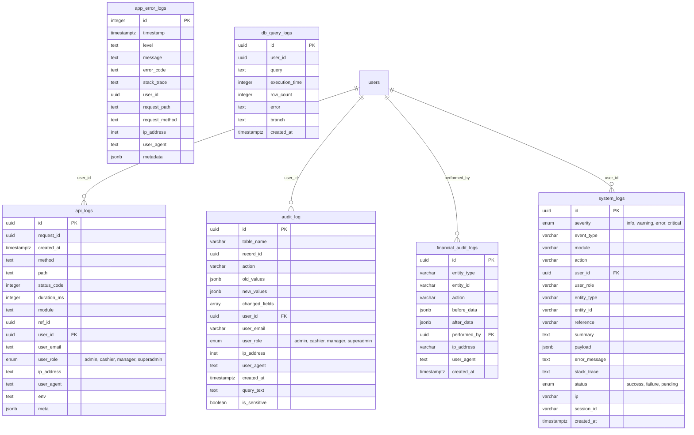
```mermaid
erDiagram

    audit_log {
        uuid id PK
        varchar table_name
        uuid record_id
        varchar action
        jsonb old_values
        jsonb new_values
        array changed_fields
        uuid user_id FK
        varchar user_email
        enum user_role "admin, cashier, manager, superadmin"
        inet ip_address
        text user_agent
        timestamptz created_at
        text query_text
        boolean is_sensitive
    }

    api_logs {
        uuid id PK
        uuid request_id
        timestamptz created_at
        text method
        text path
        integer status_code
        integer duration_ms
        text module
        uuid ref_id
        uuid user_id FK
        text user_email
        enum user_role "admin, cashier, manager, superadmin"
        text ip_address
        text user_agent
        text env
        jsonb meta
    }

    app_error_logs {
        integer id PK
        timestamptz timestamp
        text level
        text message
        text error_code
        text stack_trace
        uuid user_id
        text request_path
        text request_method
        inet ip_address
        text user_agent
        jsonb metadata
    }

    db_query_logs {
        uuid id PK
        uuid user_id
        text query
        integer execution_time
        integer row_count
        text error
        text branch
        timestamptz created_at
    }

    system_logs {
        uuid id PK
        enum severity "info, warning, error, critical"
        varchar event_type
        varchar module
        varchar action
        uuid user_id FK
        varchar user_role
        varchar entity_type
        varchar entity_id
        varchar reference
        text summary
        jsonb payload
        text error_message
        text stack_trace
        enum status "success, failure, pending"
        varchar ip
        varchar session_id
        timestamptz created_at
    }

    financial_audit_logs {
        uuid id PK
        varchar entity_type
        varchar entity_id
        varchar action
        jsonb before_data
        jsonb after_data
        uuid performed_by FK
        varchar ip_address
        text user_agent
        timestamptz created_at
    }

    %% ---------- Relaciones ----------
    users ||--o{ api_logs : "user_id"
    users ||--o{ audit_log : "user_id"
    users ||--o{ financial_audit_logs : "performed_by"
    users ||--o{ system_logs : "user_id"

```

Sistema

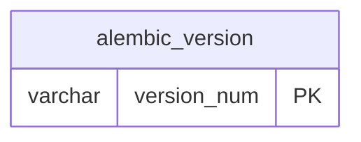
```mermaid
erDiagram

    alembic_version {
        varchar version_num PK
    }

```
